# Lab 4 — Infrastructure as Code (Terraform & Pulumi)


> Provision cloud infrastructure using code with Terraform and Pulumi, comparing both approaches.

## Student Information

- **Name:** Anastasia Kuchumova  
- **Date:** February 19, 2026  
- **Course:** DevOps Core Course  
- **GitHub Branch:** `lab04`

---

## 1. Cloud Provider & Infrastructure

### Cloud Provider Selection

**Provider:** Yandex Cloud

**Rationale for choosing Yandex Cloud:**

- ✅ **Accessibility:** Available in Russia without VPN requirements  
- ✅ **Free Tier:** Offers 1 VM with 20% vCPU, 1 GB RAM, and 10 GB SSD storage  
- ✅ **No Credit Card Required:** Can start immediately  
- ✅ **Documentation:** High-quality Russian and English documentation  
- ✅ **Stability:** Reliable performance and minimal downtime  
- ✅ **Integration:** Good integration with Yandex ecosystem  

---

### Infrastructure Specifications

| Parameter | Value |
|----------|------|
| Instance Type | standard-v3 (2 vCPU, 2 GB RAM) |
| Region / Zone | ru-central1-a |
| OS | Ubuntu 24.04 LTS |
| Boot Disk | 10 GB network-hdd |
| Network | 192.168.10.0/24 |
| Cost | $0 (free tier) |

---

### Resources Created

| Resource | Name | Purpose |
|--------|------|--------|
| VPC Network | lab4-network | Network isolation |
| Subnet | lab4-subnet | Private subnet |
| Security Group | lab4-security-group | Firewall rules |
| VM | lab4-vm / lab4-pulumi-vm | Compute |
| Public IP | Dynamic | External access |

---

### Security Group Rules

| Direction | Protocol | Port | CIDR | Description |
|---------|----------|------|------|------------|
| Ingress | TCP | 22 | 0.0.0.0/0 | SSH |
| Ingress | TCP | 80 | 0.0.0.0/0 | HTTP |
| Ingress | TCP | 5000 | 0.0.0.0/0 | App |
| Egress | ANY | ALL | 0.0.0.0/0 | Allow all |

---

## 2. Terraform Implementation

### Versions

| Tool | Version |
|-----|--------|
| Terraform | 1.10.5 |
| Provider | yandex-cloud/yandex 0.13.0 |
| Platform | macOS (Apple Silicon) |

---

### Terraform Project Structure

```text
terraform/
├── main.tf
├── variables.tf
├── outputs.tf
├── provider.tf
├── terraform.tfvars
└── .gitignore
```

---

### Key Decisions

1. Logical file separation  
2. Full parameterization  
3. Public outputs (IP, SSH)  
4. Labels for identification  
5. Sensitive secrets handling  
6. Free-tier compliance  

---

### Example Terraform Code

```hcl
resource "yandex_compute_instance" "lab4_vm" {
  name        = "lab4-vm"
  platform_id = "standard-v3"
  zone        = var.zone

  resources {
    cores  = 2
    memory = 2
  }

  metadata = {
    ssh-keys = "ubuntu:${var.ssh_public_key}"
  }
}
```

---

### Terraform Challenges

| Issue | Solution |
|-----|---------|
| Wrong image ID | Used working VM image |
| SSH format | Corrected metadata |
| Network quota | Default network |
| RAM mismatch | Increased to 2 GB |
| Provider access | Mirror / VPN |

---

### Terraform Output

```text
vm_public_ip = 93.77.184.111
ssh -i ~/.ssh/yandex_cloud ubuntu@93.77.184.111
```

✅ SSH connection successful

---

## 3. Pulumi Implementation

### Versions

| Tool | Version |
|-----|--------|
| Pulumi | 3.221.0 |
| Language | Python 3.9 |
| Provider | pulumi-yandex 0.13.0 |

---

### Pulumi Structure

```text
pulumi/
├── __main__.py
├── requirements.txt
├── Pulumi.yaml
├── Pulumi.dev.yaml
└── venv/
```

---

### Pulumi VM Code

```python
vm = compute_instance.ComputeInstance(
    "lab4-vm",
    name="lab4-pulumi-vm",
    platform_id="standard-v3",
    resources={"cores": 2, "memory": 2},
)
```

---

### Pulumi Challenges

| Issue | Fix |
|-----|----|
| setuptools error | Downgrade |
| Provider URN | Unique name |
| VPC issues | Default subnet |
| SSH denied | Correct key |

---

### Pulumi Output

```text
vm_ip = 93.77.187.226
```

✅ SSH connection successful

---

## 4. Terraform vs Pulumi

| Criteria | Terraform | Pulumi |
|--------|----------|--------|
| Learning | 5/5 | 3/5 |
| Readability | 5/5 | 4/5 |
| Debugging | 3/5 | 5/5 |
| Docs | 5/5 | 4/5 |

**Preferred tool:** Terraform

---

## 5. Lab 5 Preparation

- Terraform VM kept
- IP: 93.77.184.111
- SSH: ~/.ssh/yandex_cloud

---

## Conclusion

Terraform proved faster and simpler for this lab.  
Pulumi is powerful but overkill for small infrastructure tasks.

---

## Appendix

### Terraform

```bash
terraform init
terraform apply
terraform destroy
```

### Pulumi

```bash
pulumi up
pulumi destroy
```


### Screenshots  
 1.  **pulumi_up.jpg**
    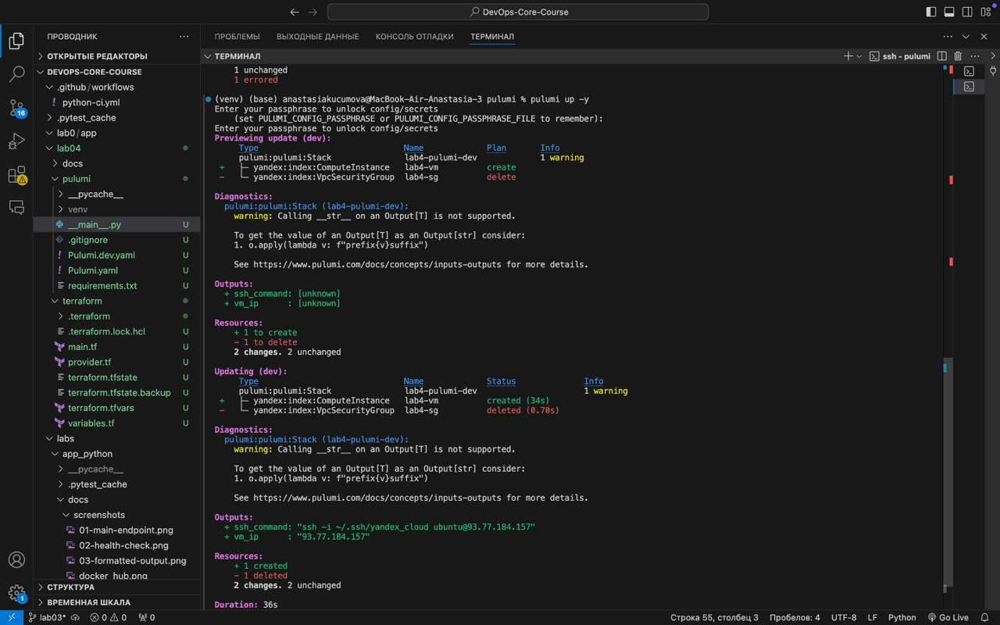

2.  **pulumi_up1.jpg**
    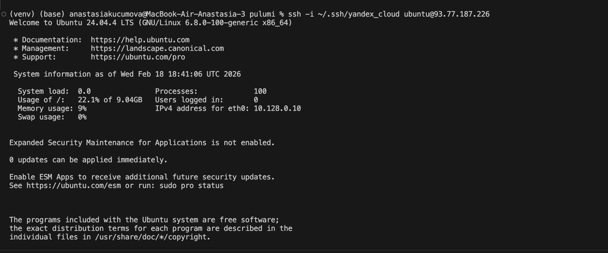

3.  **Terraform2.jpg**
    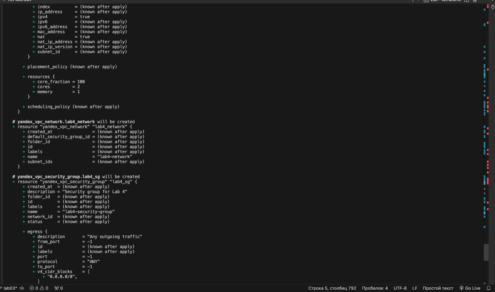

4.  **Terraform6.jpg**
    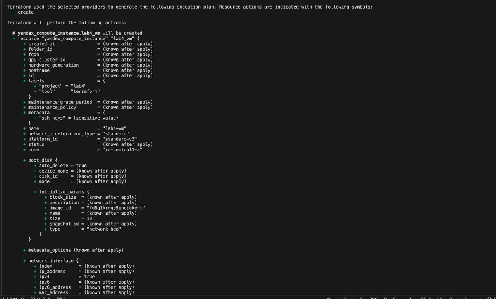

5.  **Terraform7.jpg**
    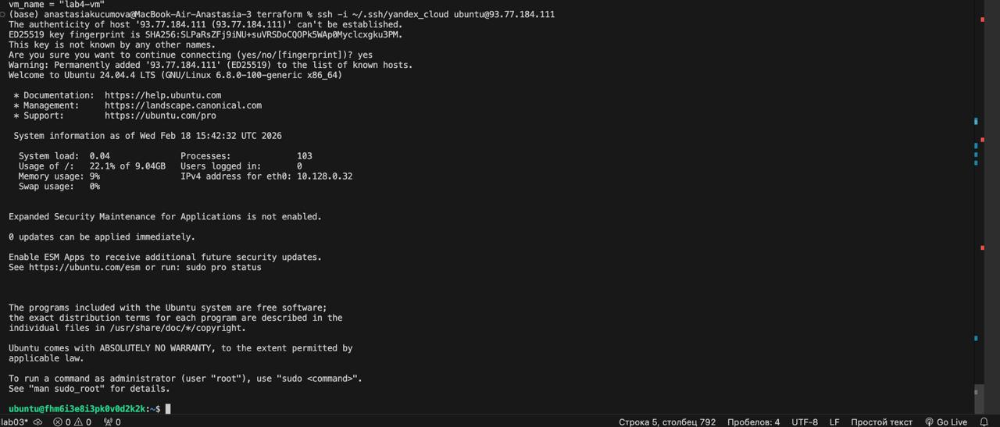

6.  **Terrafrom1.jpg**
    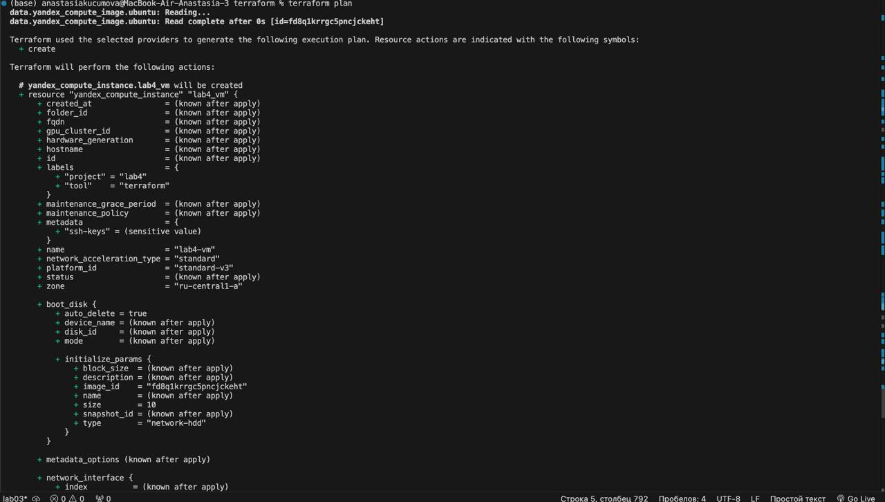

7.  **Terrafrom3.jpg**
    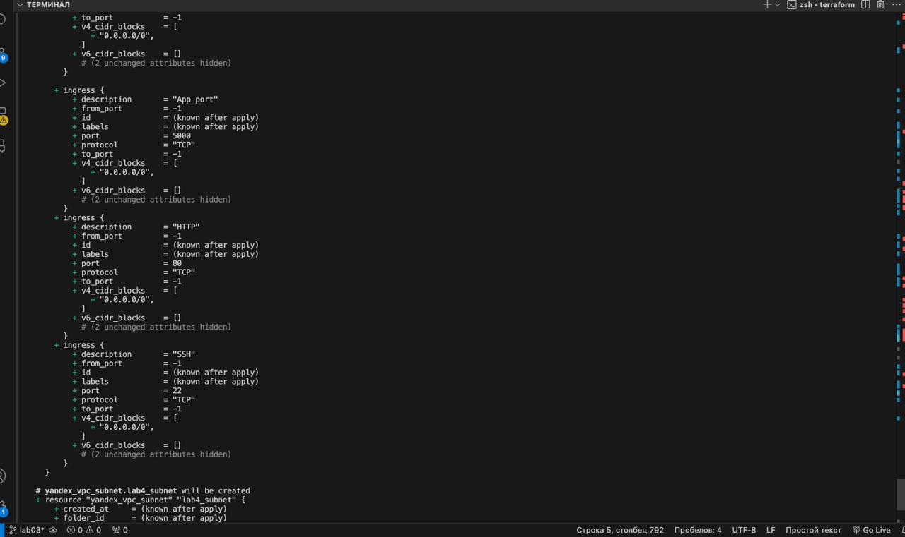

8.  **Terrafrom4.jpg**
    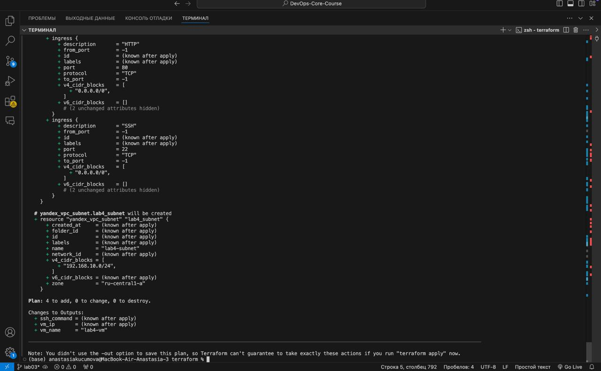

9.  **Terrafrom5.jpg**
    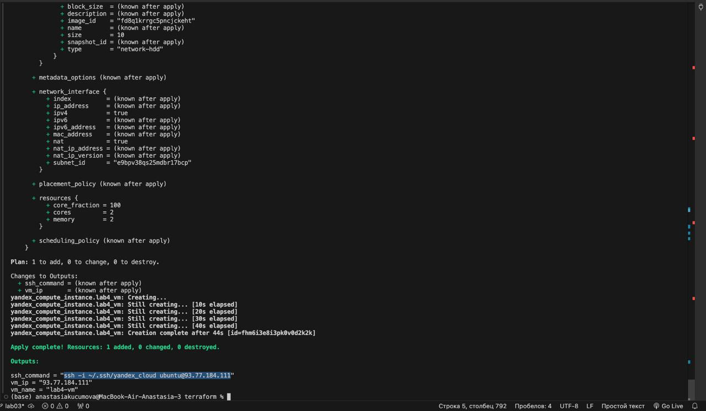

10. **Terrafrom8.png**
    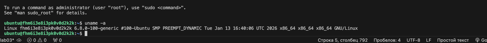

11. **TShow.jpg**
    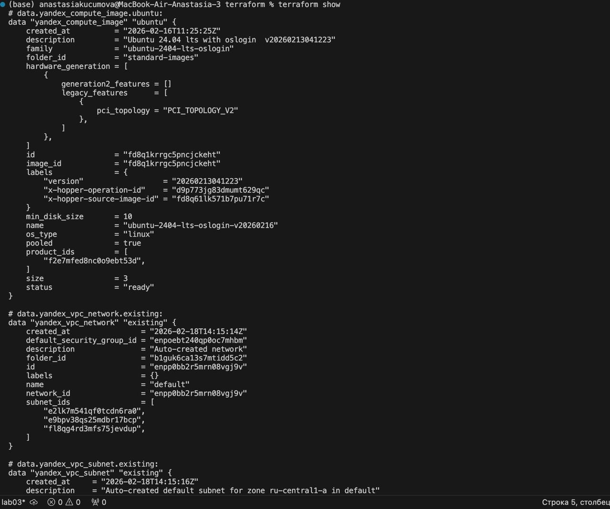

12. **TShow2.jpg**
    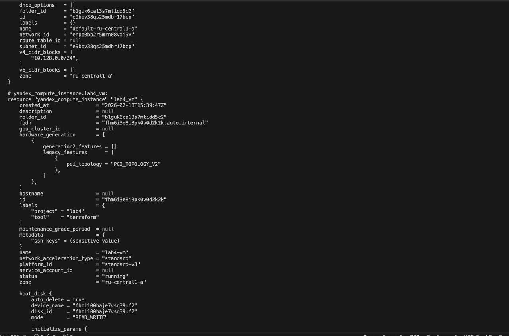

13. **TShow3.jpg**
    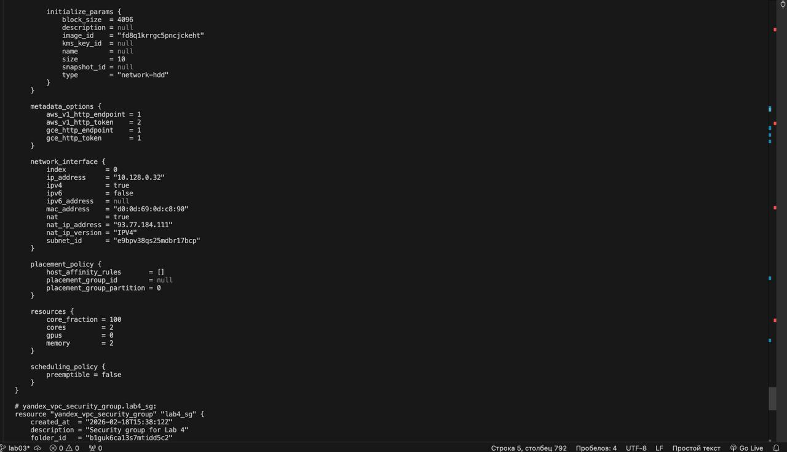

14. **TShow4.jpg**
    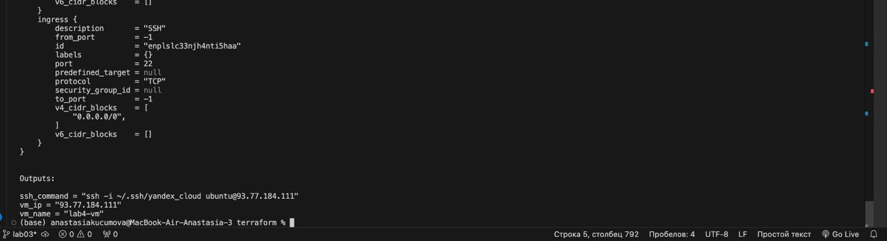