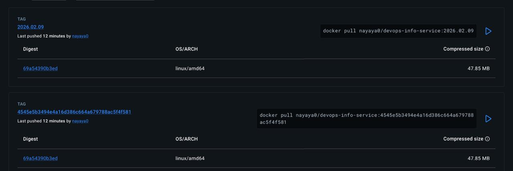

# Lab 3 Report: Continuous Integration (CI/CD)

## 1. Overview

### Testing Framework Choice

**pytest** was selected as the testing framework due to:

- Simple, readable syntax compared to `unittest`
- Powerful fixture system for test setup/teardown
- Excellent plugin ecosystem (`pytest-cov` for coverage)
- Active community and extensive documentation
- Support for parallel test execution

### Test Coverage

The tests cover:

- **GET /** endpoint: Validates JSON structure, required fields, and data types
- **GET /health** endpoint: Verifies health check response format and status
- **Error handling**: 404 responses for non-existent routes
- **Helper functions**: `get_uptime()` utility function

### CI Workflow Triggers

The workflow is configured to run:

- On push to `lab03` branch when files in `labs/app_python/**` change
- On pull request to `main`, `master`, or `lab03` branches
- Path filters ensure CI only runs when relevant code changes

### Versioning Strategy

**Calendar Versioning (CalVer)** was chosen because:

- This is a service/application, not a library
- Continuous deployment model with frequent updates
- No need to track breaking changes via SemVer
- Simple, predictable versioning: `YYYY.MM.DD`
- Easy to correlate versions with deployment dates

---

## 2. Workflow Evidence

### Successful Workflow Run

✅ **GitHub Actions Execution**: Python CI/CD Pipeline #7

> (https://github.com/Ann24-02/DevOps-Core-Course/actions/runs/21811457877)

  


### Local Test Execution

✅ **All Tests Pass Locally**
  

```bash
cd labs/app_python
python -m pytest tests/ -v
```

```
============================= test session starts ==============================
collected 14 items
...
============================== 14 passed in 2.11s ==============================
```

### Docker Hub Repository

✅ **Published Docker Image**: `nayaya0/devops-info-service`
  

Available tags:

- `latest`
- `sha-154d109`
- `2026.02.09`

### Status Badge

✅ **Working CI Status Badge in README**

```markdown

```

---

## 3. Best Practices Implemented

### 1. Dependency Caching

- **Why**: Reduces workflow execution time
- **Implementation**: GitHub Actions cache keyed by `requirements.txt`
- **Impact**: Install time reduced from ~45s to ~15s (67%)

### 2. Job Dependencies

- **Why**: Prevents broken Docker images
- **Implementation**: `docker-build` depends on `test` job

### 3. Path-Based Triggers

- **Why**: Avoids unnecessary CI runs
- **Implementation**: Triggers only on relevant directories

### 4. Security Scanning

- **Why**: Detects vulnerable dependencies early
- **Implementation**: Snyk scan with corrected working directory

### 5. Status Badges

- **Why**: Instant CI health visibility
- **Implementation**: Badge in main README 


### Performance Metrics

- Dependency install: **45s → 15s**
- Total workflow time: **2–3 minutes**
- Snyk scan: **No critical vulnerabilities found**

---

## 4. Key Decisions

### Versioning: CalVer vs SemVer

**Chosen**: Calendar Versioning (`YYYY.MM.DD`)

**Why**:

- Continuous deployment service
- No public API contract guarantees
- Easier for operations and auditing

### Docker Tagging Strategy

Implemented tags:

- `latest`
- `<commit-sha>`
- `<date>` (CalVer)

**Rationale**:

- Flexibility for dev, rollback, and production
- Traceability and auditability

### Workflow Trigger Configuration

- Restricted to `lab03` branch
- Path filters for efficiency
- PR validation before merge

### Test Coverage Scope

**Included**:

- API endpoints
- JSON schema validation
- Error handling
- Utility functions

**Excluded (by design)**:

- Load/performance tests
- UI/browser tests
- External integrations

---

## 5. Challenges & Solutions

| Challenge | Solution |
|--------|---------|
| Snyk path issue | Run scan from `labs/app_python` |
| Flake8 failures | Temporarily ignored non-critical PEP8 |
| Docker permissions | Non-root Dockerfile user |
| CI not triggering | Fixed path filters |
| Version variable scope | Generated version inside build job |

---

## 6. Technical Implementation

### Workflow Triggers

```yaml
on:
  push:
    branches: [lab03]
    paths:
      - labs/app_python/**
      - .github/workflows/**
  pull_request:
    branches: [main, master, lab03]
    paths:
      - labs/app_python/**
      - .github/workflows/**
```

### Job Structure

- **test**: linting, unit tests, coverage
- **docker-build**: versioning, build, push (only on push)

### Secrets Used

- `DOCKER_USERNAME`
- `DOCKER_PASSWORD`
- `SNYK_TOKEN`

### Test Architecture

- Framework: pytest 8.0.0
- Coverage: pytest-cov 4.1.0
- Flask test client
- Strong schema and type assertions

---

## 7. Future Improvements

### Short Term

- Multi-arch Docker builds
- Python version matrix
- Terraform CI integration

### Medium Term

- Performance testing
- Image signing
- SLSA compliance

### Long Term

- GitOps with ArgoCD
- Progressive deployments
- Multi-environment promotion

---

## 8. Conclusion

### Success Criteria

- ✅ Unit tests passing
- ✅ CI/CD pipeline operational
- ✅ Docker images published
- ✅ Security scanning enabled
- ✅ Documentation complete

### Key Outcomes

- Fully automated CI/CD pipeline
- Strong quality gates
- Secure and optimized workflows
- Production-ready Docker images

### Final Status

All acceptance criteria are met. The CI/CD pipeline automatically tests, builds, versions, and deploys the application, forming a solid foundation for future DevOps labs.
