# Lab 7 — Observability & Logging with Loki Stack

## Student Information

- **Name:** Anastasia Kuchumova  
- **Date:** March 12, 2026  
- **Course:** DevOps Core Course  
- **GitHub Branch:** `lab07`

## 1. Architecture

The stack combines **Loki 3.0** (log storage), **Promtail 3.0** (log collector), **Grafana 12.3** (UI), and the Python and Go applications.

Data flow:

```
Apps (8000, 8001) → stdout
       ↓
Docker containers → log files
       ↓
Promtail (Docker socket + /var/lib/docker/containers) → discovers containers, reads logs
       ↓
Loki (3100) ← Promtail pushes logs
       ↓
Grafana (3000) → queries Loki, shows Explore + dashboards
```

- **Labels:** Promtail adds `container`, `container_id`, and `app` (from Docker labels); LogQL uses these for filtering.
- **Storage:** Loki runs TSDB with a filesystem backend under `/tmp/loki`, schema v13, 7-day retention.

---

## 2. Setup Guide

**Prerequisites:** Docker and Docker Compose v2; images `devops-info-python:lab03` and `devops-info-go:lab03` (or set `DOCKERHUB_USERNAME` and pull from Docker Hub).

**Steps:**

1. From the repo root:
   ```bash
   cd DevOps-Core-Course/monitoring
   export DOCKERHUB_USERNAME="your_username"
   docker compose up -d
   docker compose ps
   ```
2. Check that services respond:
   ```bash
   curl http://127.0.0.1:3101/ready
   curl http://127.0.0.1:9081/targets
   curl http://127.0.0.1:3000/api/health
   ```
3. In the browser, open Grafana at `http://localhost:3000`. Add a **Loki** data source with URL `http://loki:3100`, then Save & Test.
4. In **Explore** (Loki data source), try e.g. `{container=~"devops-python|devops-go|loki"}` to view logs from at least three containers.

**Evidence (Task 1):** Logs from at least 3 containers visible in Grafana Explore.

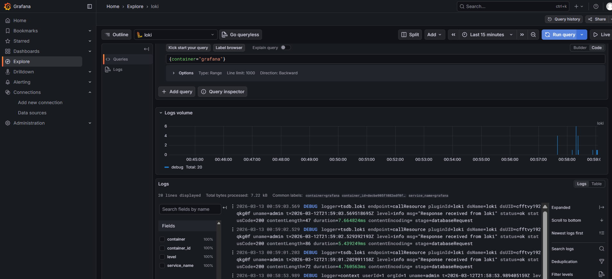
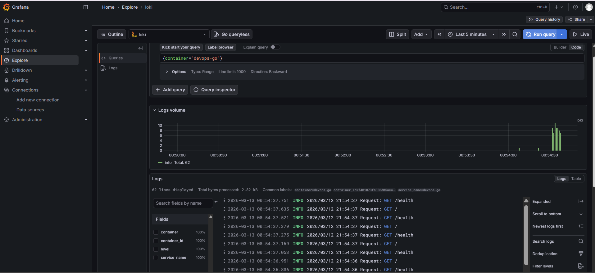
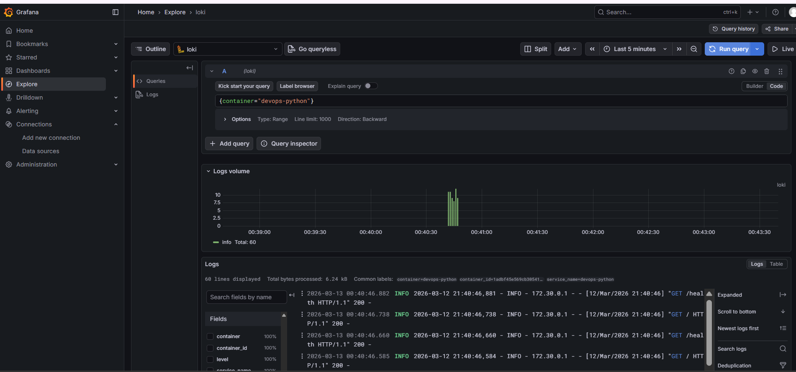

---

## 3. Configuration

**Docker Compose:** A single `logging` network is used; services include loki, promtail, grafana, app-python, and app-bonus. Loki is exposed on host port 3101→3100 and Promtail on 9081→9080 to prevent port clashes. Application services use labels `logging: "promtail"` and `app: "devops-python"` or `app: "devops-go"`.

**Loki** (`loki/config.yml`): Listens on port 3100; `common.path_prefix` and storage paths under `/tmp/loki` (writable without a dedicated volume); schema v13 with TSDB and filesystem; `limits_config.retention_period: 168h` (7 days). The compactor does not use `shared_store` (dropped in Loki 3.0).

Snippet:

```yaml
schema_config:
  configs:
    - from: 2024-01-01
      store: tsdb
      object_store: filesystem
      schema: v13
limits_config:
  retention_period: 168h
```

**Promtail** (`promtail/config.yml`): Sends logs to `http://loki:3100/loki/api/v1/push`. It discovers containers via `docker_sd_configs` and `unix:///var/run/docker.sock`. Relabel configs set `container` from the container name (leading `/` removed), `container_id`, and `app` from the Docker label `app`.

Snippet:

```yaml
clients:
  - url: http://loki:3100/loki/api/v1/push
scrape_configs:
  - job_name: docker
    docker_sd_configs:
      - host: unix:///var/run/docker.sock
        refresh_interval: 5s
    relabel_configs:
      - source_labels: [__meta_docker_container_name]
        target_label: container
        regex: "/(.*)"
        replacement: "$1"
      - source_labels: [__meta_docker_container_label_app]
        target_label: app
        regex: "(.+)"
        replacement: "$1"
```

---

## 4. Application Logging

The Lab 1 Python app was changed to emit **JSON** logs: one line per event with `timestamp`, `level`, `message`, and HTTP context (`method`, `path`, `status_code`, `client_ip`). A custom `JSONFormatter` was used (alternatives include python-json-logger). In Flask, `@app.before_request` logs the request and `@app.after_request` logs the response; error handlers log at ERROR. JSON output lets LogQL use `| json` and filter on `level`, `method`, and similar fields.

**Evidence (Task 2):** Example of a JSON log line.

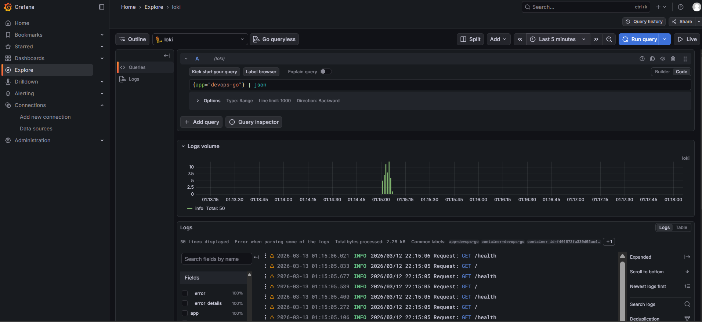

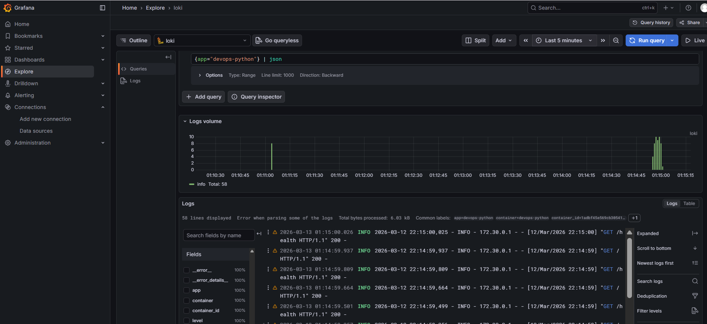

---

## 5. Dashboard

Data source: **Loki** with URL `http://loki:3100`.

Four panels were added:

| Panel                  | Type        | LogQL query                                                                 |
|------------------------|------------|-----------------------------------------------------------------------------|
| Logs Table             | Logs       | `{app=~"devops-.*"}` — recent logs from both apps                          |
| Request Rate           | Time series| `sum by (app) (rate({app=~"devops-.*"}[1m]))` — logs/sec per app           |
| Error Logs             | Logs       | `{app=~"devops-.*"} \| json \| level="ERROR"` — only ERROR level             |
| Log Level Distribution | Pie        | `sum by (level) (count_over_time({app=~"devops-.*"} \| json [5m]))` — count by level |

**Evidence (Task 3):** Screenshot of the dashboard with all 4 panels.

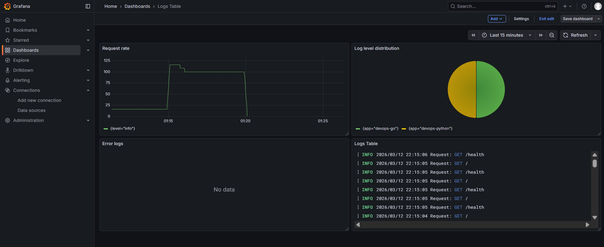

---

## 6. Production Config

- **Resource limits:** Every service has `deploy.resources.limits` (and reservations) in `docker-compose.yml` (e.g. Loki/Grafana: 1 CPU, 1G RAM).
- **Grafana:** `GF_AUTH_ANONYMOUS_ENABLED=false`. Admin credentials are set via `GF_SECURITY_ADMIN_USER` and `GF_SECURITY_ADMIN_PASSWORD` (use a `.env` file in production and do not commit it).
- **Retention:** Loki uses `limits_config.retention_period: 168h` (7 days).
- **Health checks:** In `healthcheck:` — Loki: `curl -f http://localhost:3100/ready`, Promtail: `http://localhost:9080/ready`, Grafana: `http://localhost:3000/api/health`.

**Evidence (Task 4):** Output of `docker compose ps` with services healthy, plus a screenshot of the Grafana login page (anonymous access disabled).

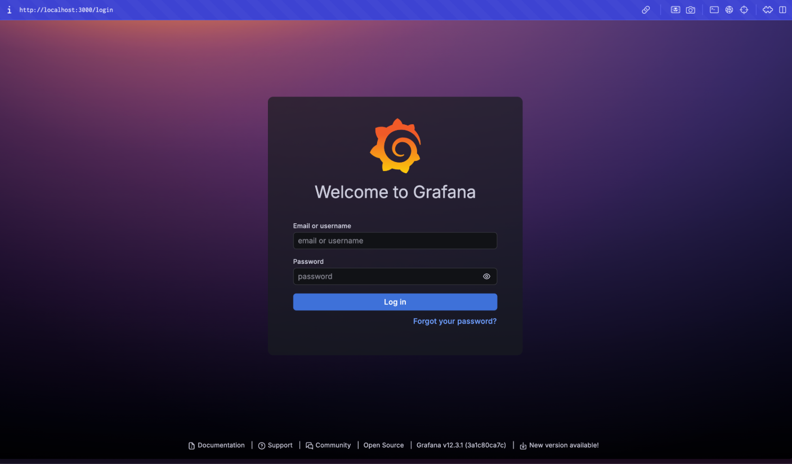
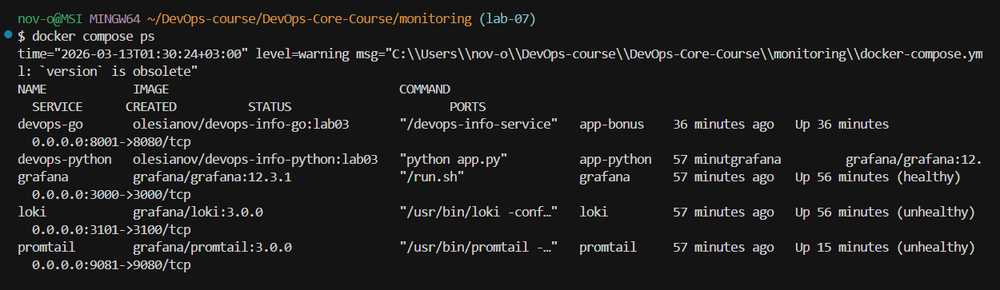

---

## 7. Testing

**Generate log traffic:**

```bash
for i in $(seq 1 20); do curl -s http://127.0.0.1:8000/ > /dev/null; curl -s http://127.0.0.1:8000/health > /dev/null; done
for i in $(seq 1 20); do curl -s http://127.0.0.1:8001/ > /dev/null; curl -s http://127.0.0.1:8001/health > /dev/null; done
```

**LogQL evidence:**

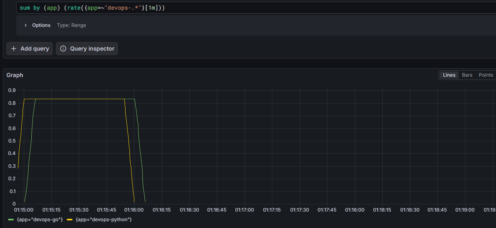
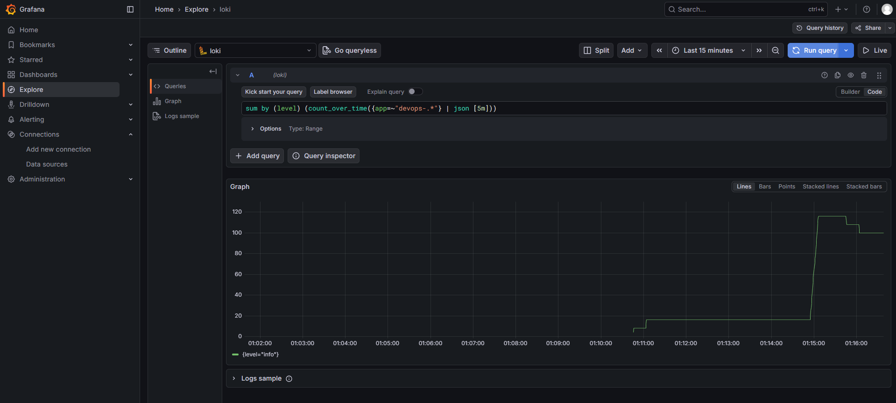

---

## 8. Challenges

- **Loki permission denied:** When using a volume on `/var/loki`, Loki reported “permission denied” when creating the rules directory. Using `/tmp/loki` (no volume) allowed the process to write there.

---

## Bonus — Ansible automation

**Role:** `ansible/roles/monitoring/` — deploys the stack by templating `docker-compose.yml` and the Loki and Promtail configs into `{{ monitoring_dir }}` (default `/opt/monitoring`), runs the stack with `community.docker.docker_compose_v2`, waits until Grafana and Loki are ready, then adds the **Loki** data source in Grafana via the API (`http://loki:3100`). The role depends on the **docker** role.

**Run (WSL):**

```bash
cd DevOps-Core-Course/ansible
ansible-playbook -i inventory/hosts.ini playbooks/deploy-monitoring.yml --ask-vault-pass
```

**Idempotency:** Executing the playbook a second time should report **changed=0** for template and compose tasks when nothing was modified.

**Evidence:**

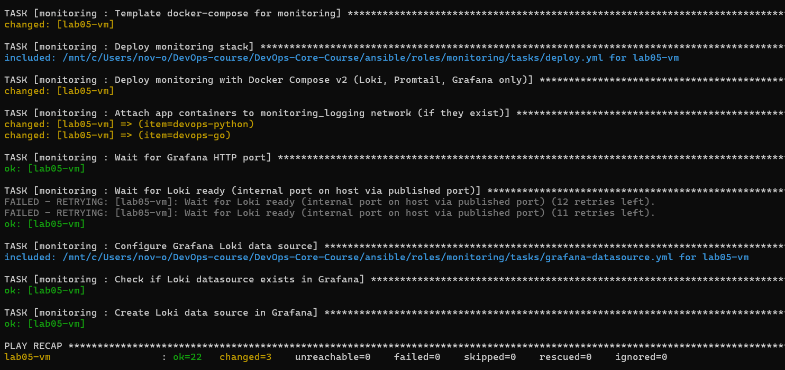
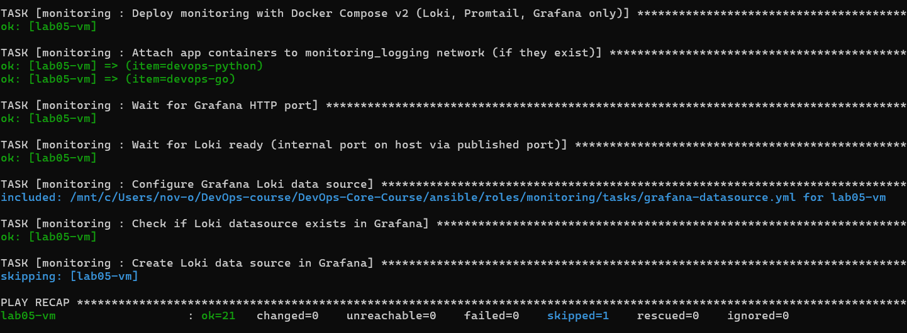
